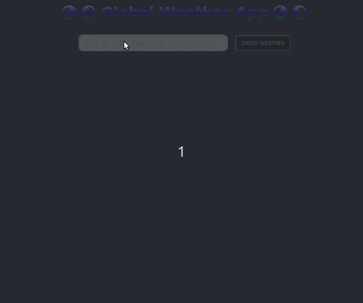

[![Contributors][contributors-shield]][contributors-url]
[![Forks][forks-shield]][forks-url]
[![Stargazers][stars-shield]][stars-url]
[![Issues][issues-shield]][issues-url]

<!-- PROJECT LOGO -->

    
  
 
   
  <h3 align="center">Weather App <a href='https://rawcdn.githack.com/thsvr/weather-app/e8cda20abb76e3e82408e7fe87afa26f723370a4/dist/index.html'> Live version</a></h3> 
  
 This project is part of the Microverse Javacript Section 
    
  <a href="https://github.com/thsvr/weather-app/issues">Report Bug</a> 
  · 
  <a href="https://github.comthsvr/weather-app/issues">Request Feature</a> 
  
 
  

<!-- TABLE OF CONTENTS -->

## Table of Contents

- [About the Project](#about-the-project)
  - [Installation](#installation)
  - [Built With](#built-with)
- [Contact](#contact)
- [Acknowledgements](#acknowledgements)

<!-- ABOUT THE PROJECT -->

## About The Project

This project consists in a application that users can check the weather condition typing the name of the city.

## Preview

<!-- ABOUT THE PROJECT -->

## Installation

Download or clone the [repo here](https://github.comthsvr/weather-app), enter the directory in the terminal and run the commands:

- `npm i`
- `npm run start`
  Your default browser should open the app at the localhost:8080

### Built With

This project was built using these technologies.

- HTML
- CSS3
- Vanila Javascript
- Webpack

<!-- CONTACT -->

## Contact

👤 **Thaís Vieira Azevedo**

- Github: [@thsvr](https://github.com/thsvr)
- Twitter: [@vr_ths](https://twitter.com/vr_ths)
- Linkedin: [Thaís V.](https://www.linkedin.com/in/vr-ths-zd/)
- Email: [vr.ths.zd@gmail.com](vr.ths.zd@gmail.com)

 
 

<!-- ACKNOWLEDGEMENTS -->

## Acknowledgements

- [Microverse](https://www.microverse.org/)
- [The Odin Project](https://www.theodinproject.com/)
- [MDN](https://developer.mozilla.org/en-US/docs/Web/JavaScript)

<!-- MARKDOWN LINKS & IMAGES -->
<!-- https://www.markdownguide.org/basic-syntax/#reference-style-links -->

[contributors-shield]: https://img.shields.io/github/contributors/thsvr/weather-appsvg?style=flat-square
[contributors-url]: https://github.com/thsvr/weather-app/graphs/contributors
[forks-shield]: https://img.shields.io/github/forks/thsvr/weather-app.svg?style=flat-square
[forks-url]: https://github.com/thsvr/weather-app/network/members
[stars-shield]: https://img.shields.io/github/stars/thsvr/weather-app.svg?style=flat-square
[stars-url]: https://github.com/thsvr/weather-app/stargazers
[issues-shield]: https://img.shields.io/github/issues/thsvr/weather-app.svg?style=flat-square
[issues-url]: https://github.com/thsvr/weather-app/tree/todolist
[product-screenshot]: img/screenshot.PNG
